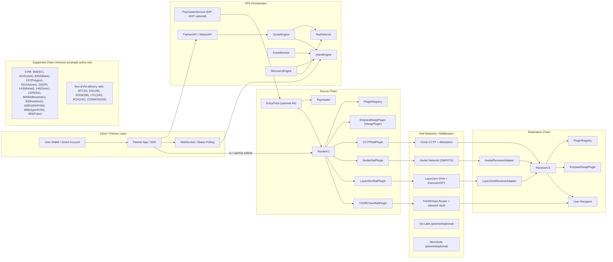
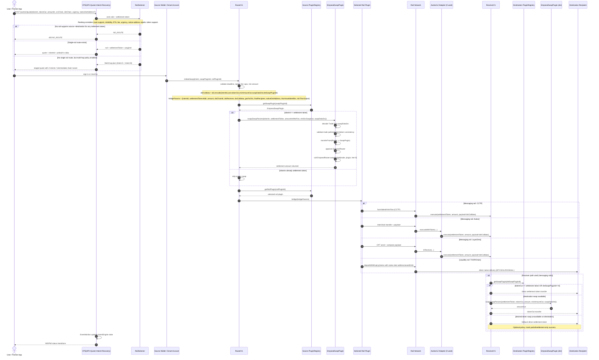
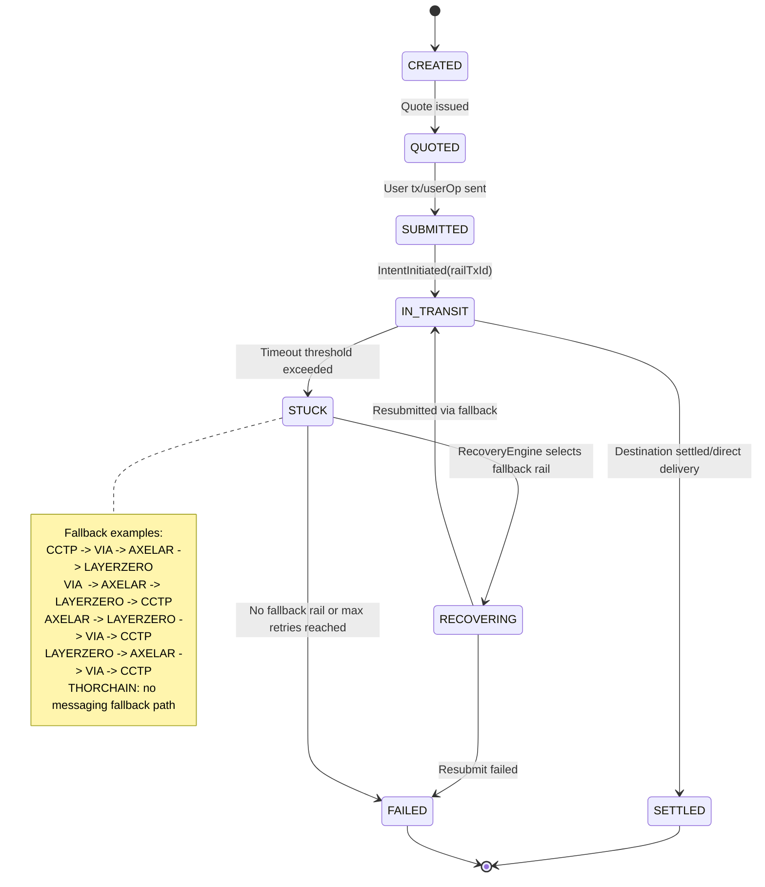
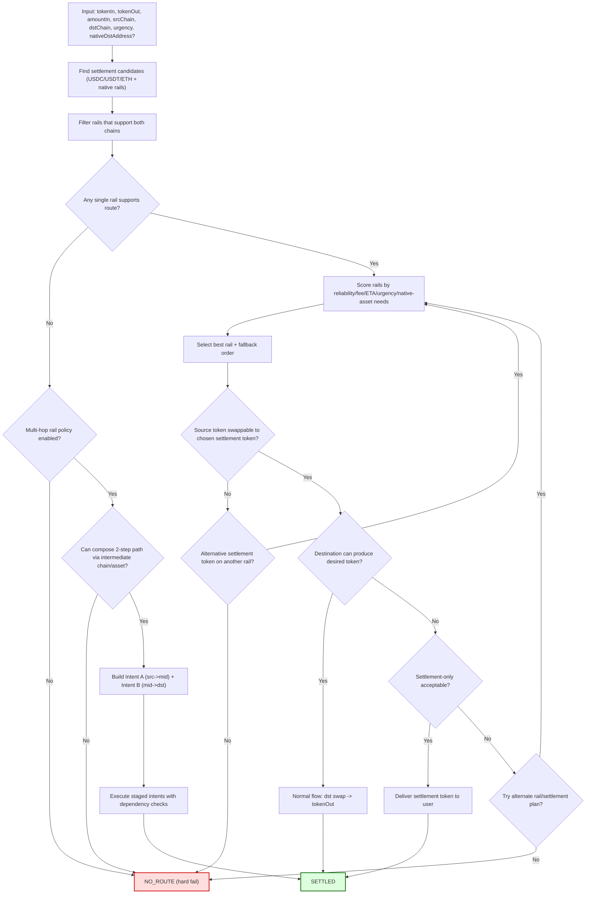
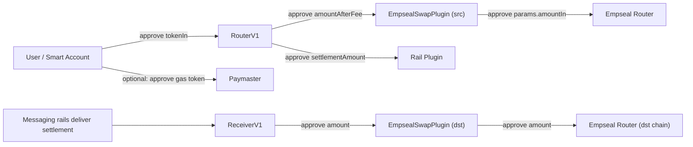
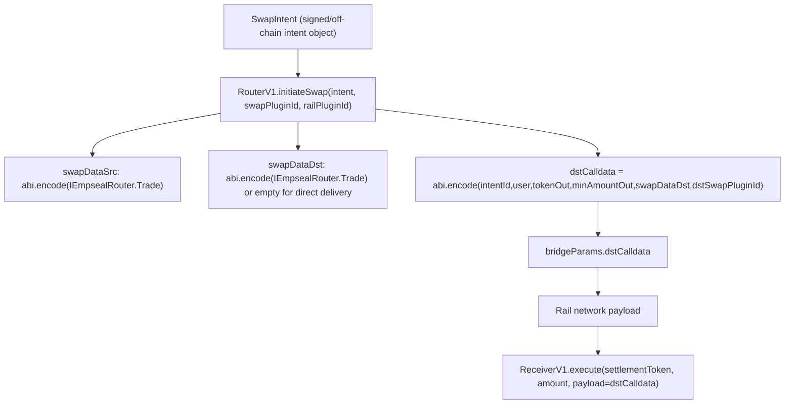

# RuFlo End-to-End Mermaid Diagrams

This file contains complete Mermaid diagrams for the full cross-chain swap implementation, including rails, intents, calldata, approvals, settlement paths, fallback logic, and no-route/multi-hop scenarios.

## 1) System Topology (Entities + Contracts + Infra)

## 2) End-to-End Sequence (Intent + Calldata + Approvals + Settlement + Branches)

## 3) Intent State Machine + Recovery/Fallback Logic

## 4) Route Decision + No-Route + Multi-Hop Through Rails

## 5) Approval/Allowance Matrix (Who Approves Whom)

## 6) Calldata Contract Boundaries

